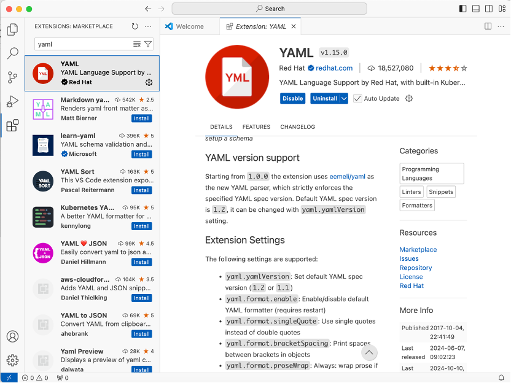
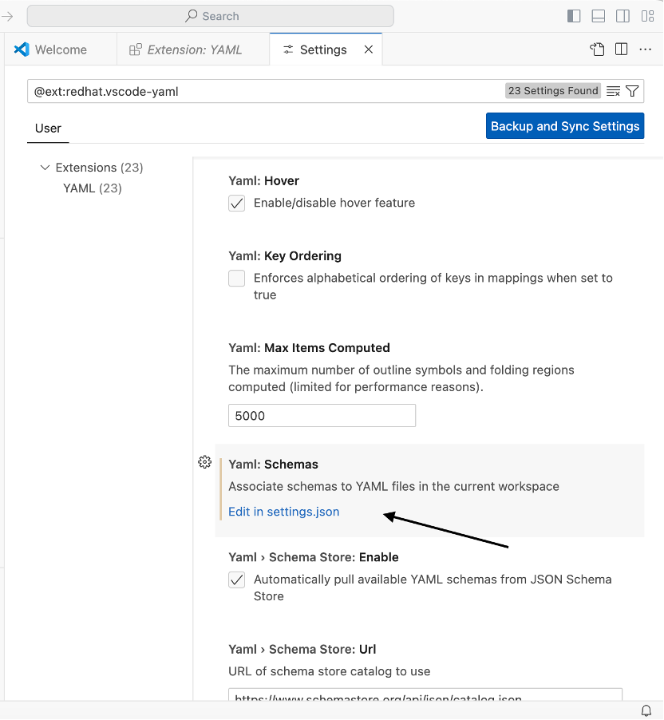
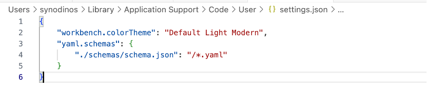

# Setting Up Custom JSON Schema Validation for YAML Files in Visual Studio Code (VSCode)
## Overview
JSON Schema is a declarative language that provides a standardized way to describe and validate JSON data. It describes the content, structure, data types, and expected constraints within a JSON document, which helps ensure the consistency and integrity of JSON data in different applications. JSON schema validation in VSCode offers several benefits:
##### Structured Data Description: 
JSON Schema allows developers to describe the structure, constraints, and data types of existing JSON data.
##### Rule Definition and Enforcement: 
By adhering to JSON schema constraints, it becomes easier to exchange structured data between applications as it maintains a consistent pattern.
##### Produce clear documentation: 
JSON Schema supports the creation of machine and human readable documentation.
##### Extensibility: 
JSON Schema offers high adaptability to developers' needs. Custom keywords, formats, and validation rules can be created to tailor schemas according to specific requirements.
##### Data Validation: 
JSON Schema ensures data validity through:
##### • Automated Testing: 
Validation enables automated testing, ensuring data consistently complies with specified rules and constraints.
##### • Improved Data Quality: 
By enforcing validation rules, JSON Schema aids in maintaining the quality of client-submitted data, reducing inconsistencies, errors, and potential security vulnerabilities.
##### Rich Tooling Ecosystem: 
The JSON Schema community offers a wealth of tools and resources across various programming languages to help developers create, validate, and integrate schemas.

JSON Schema can be used to validate YAML documents.  YAML Ain't Markup Language (YAML) is a powerful data serialization language that aims to be human friendly. Most JSON is syntactically valid YAML, but idiomatic YAML follows very different conventions. While YAML has advanced features that cannot be directly mapped to JSON, most YAML files use features that can be validated by JSON Schema. JSON Schema is the most portable and broadly supported choice for YAML validation.

## Step-by-Step Guide
Follow these steps to set up custom JSON schema validation for your YAML files in VSCode:

#### Prerequisites:
1.	Install VSCode on your system.
2.	Install YAML extension for VSCode

Since the new schema is not in the Schema Store, you must register it on VS Code.

•	As we are creating a Schema for a YAML file, make sure you have the YAML Extension installed before continuing.

•	Open the settings for the YAML extension and search for "Yaml: Schemas" and click "Edit in settings.json".

•	The "settings.json" file will open. you need to search again for the "yaml.schemas" object. If it doesn´t exist yet, you will have to create it.
This property represents a key-value, where the key is the absolute path to the schema file on our system and the value is a glob expression that specifies the files that the schema will be applied. In my case it looks like this:

•	Save the file and reload VSCode to finish the process.
If everything worked as expected, when we create a new .yaml file and press CTRL + Space, VS Code should then display the suggestions based on the schema we created for this file type.

## Working Example:
